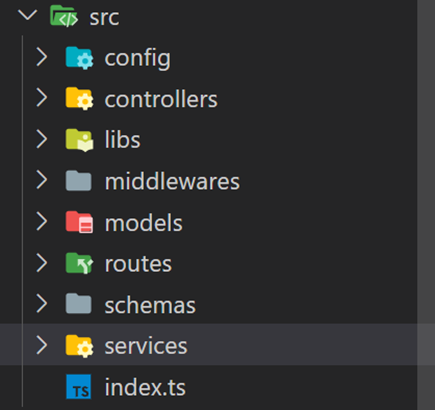
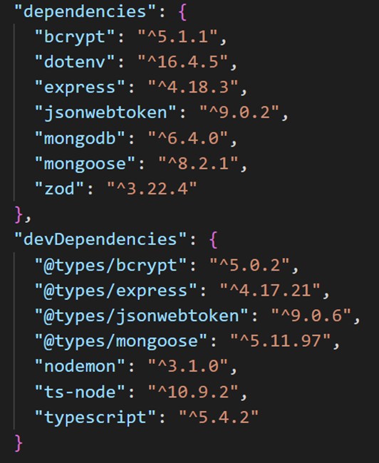
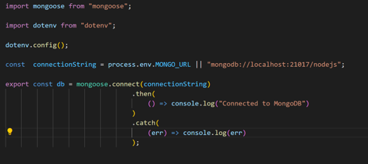
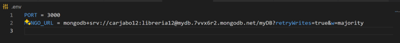
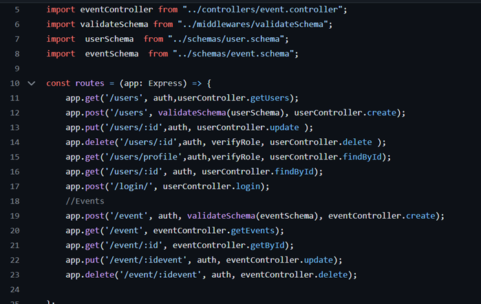

# EventManagement

**Integrantes:**

•	Diana Lorena Balanta Solano – A00377319

•	Carlos Javier Bolaños Riascos – A00377995

•	Danna Alexandra Espinosa Arenas – A00378613

### **Objetivo:**

•	El taller tiene como objetivo evaluar la aplicación de conocimientos adquiridos en la primera unidad del curso sobre la herramienta NodeJS, el framework Express y el lenguaje de programación TypeScript. 
Proceso de desarrollo:

•	**Configuración del proyecto:** Para poder iniciar con un proyecto de NodeJS junto con el framework Express debemos ejecutar el comando “npm init”. Con la inicialización agregamos las diferentes carpetas dentro del paquete “src” con el fin de seguir con la instalación de Express en el proyecto (para poder instalar express se usó “npm i express”). La estructura de carpetas usada en el paquete “src” fue:

 
Con el framework dentro del proyecto, pasamos a instalar las siguientes dependencias, con el fin de poder cumplir con los requerimientos de comunicación con la base de datos no relacional (Mongodb), autentificación y autorización de usuarios y seguridad e encriptación en los datos. 

 
Para instalar cada una de las dependencias se tuvo que usar el comando “npm i” (para instalar la dependencia) y “npm -D” (para instalar la dependencia como dependencia de desarrollo en el proyecto).

•	**Conexión con base de datos MongoDB:**. Para poder garantizar la conexión con MongoDB fue necesario agregar las dependencias “mongoose” y “mongodb”. Además de agregar el driver de conexión en el archivo “.env”. Con este driver, damos los permisos en el proyecto para acceder a la base de datos y poder realizar las operaciones CRUD sobre los usuarios y eventos. La configuración del “.env” es usada en el archivo “db.ts” donde se inicia la conexión a MongoDB.  
 

 
**Nota:** Para verificar el funcionamiento con MongoDB se recomienda usar su propia base de datos y driver de conexión. 

•	**Gestión de usuarios:** Para poder registrar usuario en nuestra aplicación, debemos tener en cuenta sus datos, además del posible rol que puede ejercer dentro de la organización. Como el objetivo de la aplicación es ayudar con la gestión de eventos (CRUD), los roles requeridos en las reglas del negocio son:

*     Organizador: Se encarga de crear, editar y eliminar eventos en la aplicación. Además, puede visualizarlos para tener control sobre ellos.

*     Asistente: Puede consultar y registrarse a eventos. 

Para poder garantizar de que los diferentes usuarios puedan usar la aplicación web con sus respectivos roles, es necesario hacer el registro, autenticación y autorización al iniciar sesión con JWT. Para cumplir con esto, fue necesario:

1.	Hacer el modelo de datos de los usuarios y roles. Los datos necesarios para registrar a un usuario son: email, nombre y la contraseña. Además de un rol (los dos habilitados por el momento son organizador y asistente).

2.	 Implementación de autenticación y autorización con JWT. Para poder garantizar la seguridad de los datos del proyecto, se usó la librería jwtwebtoken, que permite la generación del JSON WEB TOKENS. Además de eso se usaron middlwares, que permiten verificar en cada ruta y endpoint la validez de la sesión del usuario (ya sea organizador o asistente.) 

3.	Capa controller y service. Para poder cumplir con las operaciones CRUD es importante seguir los estandares de las aplicaciones web. Se implementó un “user.servive.ts” que permite traer los documentos desde la base de datos. Por otro lado, tenemos el controller “user.controller.ts” que permite manejar las solicitudes de cliente y mostrar la información solicitada.

•	**Gestión de eventos:** El objetivo principal de la aplicación es facilitar la gestión de los eventos, permitiendo así a los organizadores crearlos para que los asistentes puedan así, registrar su asistencia. Para cumplir con los requerimientos, se hizo: 

1.	Hacer el modelo de eventos. Los datos necesarios para poder registrar un evento son: titulo, descripción, fecha, hora y ubicación.

2.	Capa controller y service. Siguiendo la arquitectura de las aplicaciones web, se vio la necesidad de crear la controladora y servicio de eventos para tener la conexión a la base de datos y mostrar la información solicitada según las solicitudes que hace el usuario a través del controller. 

### **Ejecución del proyecto:**

•	Para poder ejecutar el proyecto, se debe hacer la configuración en la máquina local. Dado que se tiene un archivo “.gitignore” para evitar la incompatibilidad de los módulos y la memoria cache, se deben hacer los siguientes pasos para ver la ejecución:

o	Creación del directorio “node_modules”. En esta carpeta, se guardarán cada uno de los módulos o dependencias que se necesitan para que el proyecto funcione.

o	Creación del archivo “.env”. En este archivo se encuentran variables de entorno importantes para el funcionamiento y ejecución del proyecto. En el archivo específicamente tenemos el puerto en donde se alojará la aplicación web, también el driver de conexión con la base de datos de Mongo.

o	Instalación de las dependencias del proyecto. Debemos ejecutar el comando “npm i” para las dependencias y “npm -d” para las dependencias de desarrollo.

o	Ejecutar el comando “npm run dev”, este sirve para ver la ejecución final del proyecto.

### **Endpoints:**

•	Las rutas definidas en el proyecto para acceder a las funcionalidades del API RESTful son:

 
Estas siguen el estándar solicitado por el docente en la consigna del taller.

### **Complicaciones:**
 
•	Las complicaciones y obstáculos encontrados a la hora del desarrollo del proyecto fueron:

o	Errores en la inicialización del proyecto entre los integrantes. Al iniciar con la descarga de las librerías una de ellas no funcionaba del todo, por lo que, se investigó sobre las versiones o posibles problemas de compatibilidad. Al final de pudo resolver.

o	Planeación del modelo de datos. Fue difícil pensar que cual es el modelo más afín a lo que el profesor espera de nosotros. Teniamos dudas en la relación entre un organizador y los eventos que este mismo creaba para poder así tener el control de eliminarlos o editarlos.
